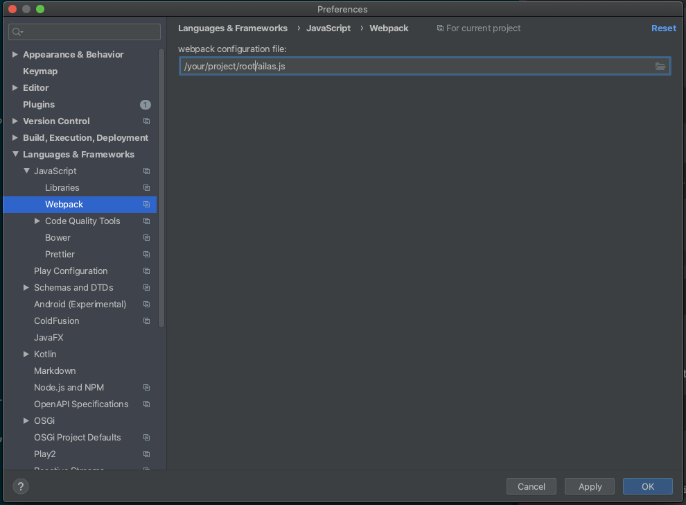

# cdktf-ts-sample

cdktf sample repository with linting and testing tools.

Includes:

- eslint
- prettier
- jest

Official information:

- https://www.hashicorp.com/blog/cdk-for-terraform-enabling-python-and-typescript-support/
- https://aws.amazon.com/jp/blogs/developer/introducing-the-cloud-development-kit-for-terraform-preview/  

Official repository: 

- https://github.com/hashicorp/terraform-cdk

## Setup

Clone from this repository: 

```
git clone git@github.com:RikutoYamaguchi/cdktf-ts-sample.git
cd cdktf-ts-sample
```

Install packages with npm:

```
npm install
```

## Usage

1. Run get command. 
2. Write TypeScript files in `src` directory.  
    ex) https://github.com/hashicorp/terraform-cdk/tree/master/examples/typescript-aws
3. Run compile and synth commands.  
4. Deploy!

## Commands

### get

Generate CDK for Terraform constructs for Terraform provides and modules used in `.gen`.

```
npm run get
```

### lint

For all files in `src` directory.

```
npm run lint-all
```

For specific files.

```
npm run lint ./src/main.ts ./src/helpers/createVpcAndSubnet.ts
```

### test

Run test target `src/**/*.test.ts`.

```
npm run test
```

### compile 

Compile TypeScript to dist directory.

```
npm run compile
```

### build

`cdktf get` and `npm run compile`

```
npm run build
```

### synth

Generate Terraform configuration to cdktf.out directory.

```
npm run synth
```

## Aliases

- `@gn` for `./gen`
- `@src` for `./src`

### For IDE

**For Jetbrains IDE**

`./alias.js` provides alias information for the IDE.



https://www.jetbrains.com/help/idea/using-webpack.html#install_and_configure_webpack

**For Visual Studio Code**

`jsconfig.json` provides JavaScript compiler options.

